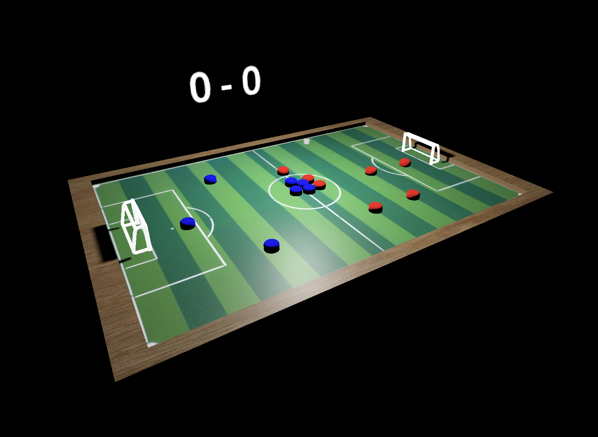

# Buttonball

Jogo de futebol de botão feito utilizando a Godot game engine.

## Funcionalidades

* Partida de futebol 7v7
* Bola com física controlada pelo jogador
* Jogadores que perseguem e interagem com a bola
* Efeitos sonoros para gols e eventos do jogo
* Controles interativos de câmera
* Sistema de pontuação em tempo real

## Controles
* Setas do teclado - Mover bola
* Arrastar o mouse - Controlar o ângulo da câmera

## Regras do Jogo
* Marque gols colocando a bola no gol do time adversário
* Jogadores IA perseguem e interagem automaticamente com a bola
* O placar exibe a pontuação atual

