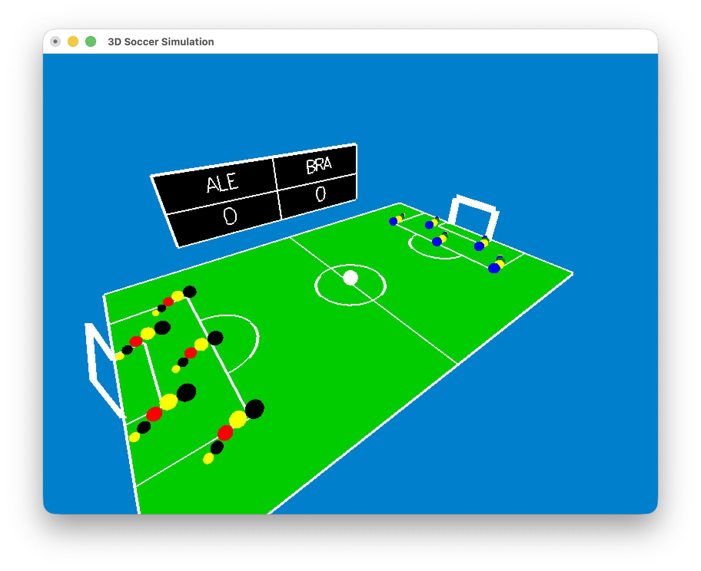

# Simulação de Futebol 3D

Um jogo de futebol 3D simples construído com OpenGL e GLUT, apresentando as equipes Brasil vs Alemanha com jogadores IA, movimento de bola baseado em física e efeitos sonoros.

[](soccer.png)


## Funcionalidades
* Partida de futebol 5v5 (Brasil vs Alemanha)
* Bola com física realista e movimento natural
* Jogadores IA que perseguem e interagem com a bola
* Efeitos sonoros para gols e eventos do jogo
* Controles interativos de câmera
* Sistema de pontuação em tempo real

## Requisitos
* macOS
* Frameworks OpenGL/GLUT
* CMake 4.0+
* Arquivos de áudio no diretório `soccer/assets/`

## Como Compilar e Executar

1. Navegue até o diretório do projeto:
   ```bash
   cd /caminho/para/seu/projeto
   ```
2. Crie o diretório de build:
   ```bash
   mkdir build && cd build
   ```
3. Configure e compile:
   ```bash
   cmake ..
   make soccer
   ```
4. Execute o jogo:
   ```bash
   ./soccer
   ```

## Controles
* Setas do teclado - Mover bola
* K - Chutar bola (inicia o áudio do jogo no primeiro chute)
* J - Fazer a bola pular
* Arrastar o mouse - Controlar o ângulo da câmera
* I/O - Zoom in/out
* R - Reiniciar o jogo
* ESC - Sair

## Regras do Jogo
* Marque gols colocando a bola no gol do time adversário
* Jogadores IA perseguem e interagem automaticamente com a bola
* O placar exibe a pontuação atual (BRA vs ALE)
* O jogo reposiciona os jogadores após cada gol

O jogo começa quando você pressiona **K** pela primeira vez para chutar a bola, o que ativa os efeitos sonoros de abertura.
